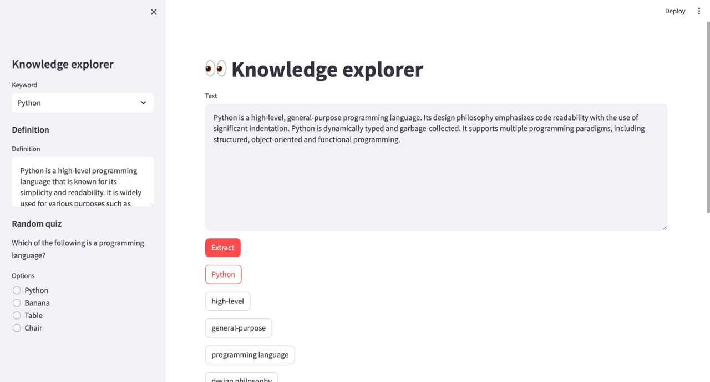

# Knowledge Explorer

## Introduction

Knowledge Explorer helps to extract keywords from a text paragraph and provide their definitions as well as a random quiz related to them.

This project is developed by our team at the Phygital Labs Hackathon 2024.

## Tech stack

Backend: [FastAPI](https://fastapi.tiangolo.com/), [OpenAI API](https://platform.openai.com/docs/api-reference/)

Frontend: [Streamlit](https://streamlit.io/)

## How to run

First, you'll need to install requirements:

```bash
pip install -r requirements.txt
```

Then run backend FastAPI:

```bash
python fastapi/src/main.py
```

And frontend Streamlit:

```bash
streamlit run streamlit/src/main.py
```

## Screenshots




